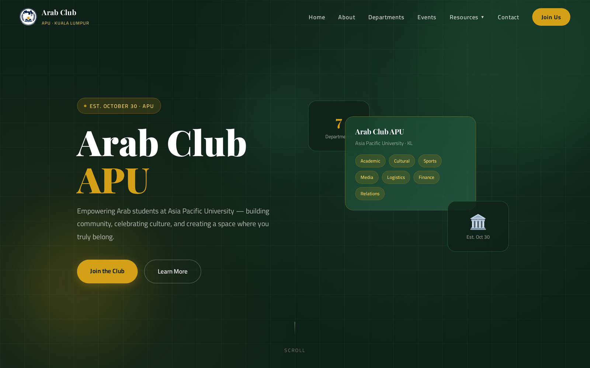
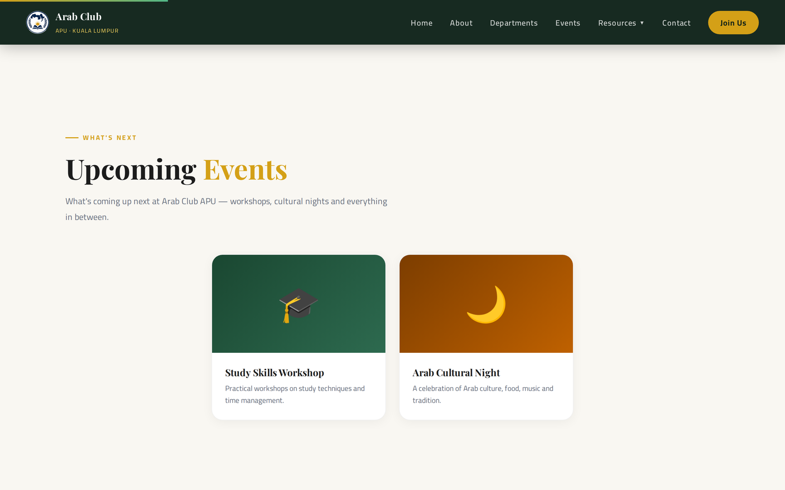
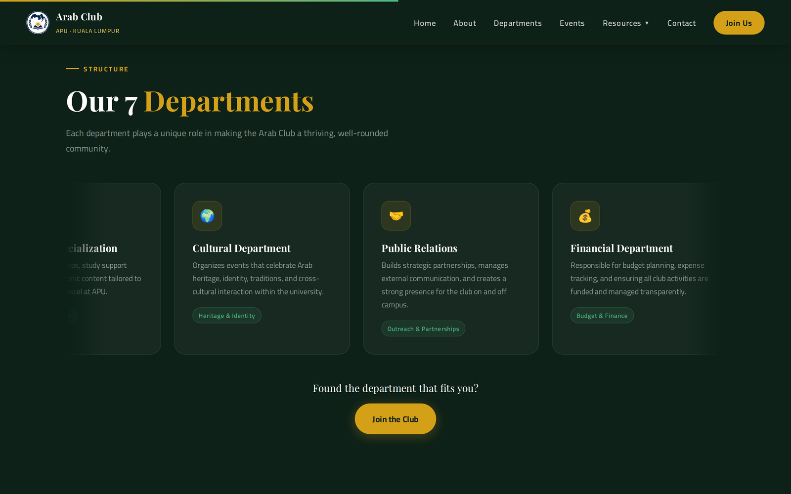
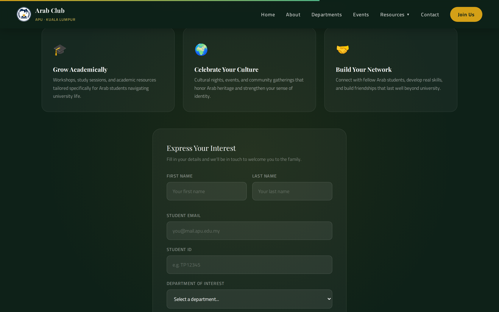
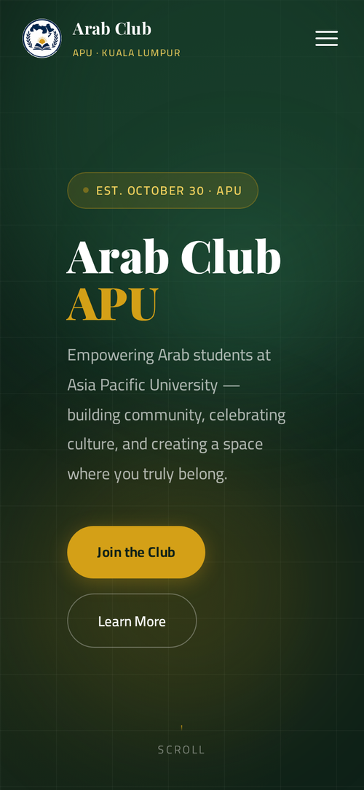

# Arab Club APU — Club Website

A full website for the Arab Club at Asia Pacific University: a single-page front end built with plain HTML, CSS and JavaScript, backed by **Supabase** for content, form handling and photo storage. Designed, built and deployed solo.

**🌐 Live site:** https://arabicclub.github.io/Arabic-Club-Website-/



| | |
|---|---|
| **Project type** | Personal / club project — built independently |
| **My role** | Everything — design, front end, back end, deployment |
| **Front end** | HTML5, CSS3, vanilla JavaScript (no frameworks, no build step) |
| **Back end** | Supabase — PostgreSQL, Edge Functions, Storage |
| **Hosting** | GitHub Pages |
| **Scale** | ~890 lines HTML · ~1,570 lines CSS · ~860 lines JavaScript |

---

## What the Site Does

| Section | Details |
|---|---|
| **Hero** | Animated entry, scroll progress bar, custom cursor, and counters that count up when scrolled into view |
| **About** | The club's story and a founder profile |
| **Upcoming Events** | Cards loaded live from the database — past events drop off automatically |
| **Past Highlights** | Photo cards that open a popup with the full write-up and a photo gallery |
| **Resources Hub** | Assignments, summaries and mock exams shared by the academic department |
| **Departments** | All seven departments, each with its own role |
| **Join Us** | Membership form that writes to the database and notifies the committee by email |
| **Vision & Mission** | The club's purpose and goals |
| **Contact** | Message form, also saved and forwarded by email |

Everything sits on one page with a sticky navigation bar, a mobile drawer menu, and scroll-reveal animations throughout.

---

## Screenshots

**Upcoming events — cards loaded from the database**



**The seven departments, in a scrolling carousel**



**Membership form — validated in the browser, saved through a Supabase Edge Function**



**On mobile**



---

## How It's Built

### Front end — no frameworks

The whole site runs on three files: `index.html`, `styles.css` and `main.js`. No React, no build tools, nothing to install — the browser gets exactly the code I wrote.

- **CSS custom properties** for the colour palette and spacing, so the theme is changed in one place
- **Responsive layout** from phone to desktop, with a slide-in navigation drawer on mobile
- **Self-contained JavaScript modules**, each wrapped in its own function so nothing leaks into the global scope: custom cursor, scroll effects, reveal animations, counters, mobile nav, carousels, the detail popup, the two forms
- **Accessibility built in** — decorative icons hidden from screen readers, meaningful alt text, and keyboard-friendly controls

### Back end — Supabase

- **PostgreSQL table (`gallery_items`)** drives the events and highlights sections. New content is added from the Supabase dashboard — no code changes, no redeploy.
- **Storage bucket (`event-photos`)** holds event images; the table stores only file names.
- **Edge Functions (`submit-join`, `submit-contact`)** receive both forms, validate the input server-side, save it, and send an email notification.

Full back-end documentation: [`docs/supabase-setup.md`](docs/supabase-setup.md) · Selected code: [`docs/code-highlights.md`](docs/code-highlights.md)

### Security decisions

- Only Supabase's **publishable key** is in the browser. The service-role key is never used in front-end code, and the email API key lives as a **function secret** on the server.
- The browser **cannot write to the database directly** — every submission goes through an Edge Function that validates it first.
- The join form has a **honeypot field**: hidden from real users, but filled in by simple bots, which get rejected.
- **The page never breaks when the back end does.** If Supabase can't be reached, the placeholder cards stay in place and the failure is logged to the console instead of leaving a blank section.

---

## Running It Locally

No build step. Clone the repository and open `index.html`, or serve the folder:

```bash
python -m http.server 8000
```

Then open `http://localhost:8000`. The events and highlights sections will show the placeholder cards until the Supabase project is configured with your own URL and publishable key in `main.js`.

## Repository Structure

```
arabic-club-website/
├── index.html          # the whole page structure
├── styles.css          # design system, layout and animations
├── main.js             # all interaction + Supabase integration
├── logo.png · favicon.png · apple-touch-icon.png · founder.jpg
├── screenshots/        # the site in action
└── docs/
    ├── supabase-setup.md   # database, storage and Edge Function setup
    └── code-highlights.md  # selected code from main.js
```

## Skills Demonstrated

`HTML5` `CSS3` `JavaScript (ES6)` `Responsive design` `Web accessibility` `Supabase` `PostgreSQL` `REST APIs` `Serverless functions` `Cloud storage` `Form validation` `Bot protection` `GitHub Pages deployment`

---

*Built independently for the Arab Club at Asia Pacific University of Technology & Innovation (APU), Kuala Lumpur.*
